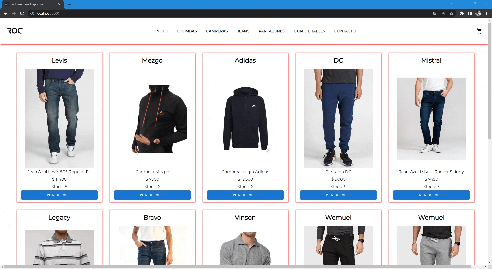

# Ecommerce indumentaria.

La idea del proyecto es realizar un Ecommerce de indumentaria.
El mismo, por el momento cuenta con las siguientes secciones:

    Home: se accede con el botón Inicio del NavBar, muestra todos los productos.

    Chombas: se accede con el botón Chombas del NavBar, muestra todos los productos de la categoría chombas.

    Camperas: se accede con el botón Camperas del NavBar, muestra todos los productos de la categoría camperas.

    Jeans: se accede con el botón Jeans del NavBar, muestra todos los productos de la categoría jeans.

    Pantalones: se accede con el botón Pantalones del NavBar, muestra todos los productos de la categoría pantalones.

    Guía de talles: muestra información sobre las medidas de los talles para tener en cuenta al realizar la compra.

    Contacto: muestra un formulario de contacto.

# Tecnología

React JS

# Dependencias extras

    Sass, Material UI, firebase, react-router-dom.

# Gif

    

# Instalación

    1-Clonar el repositorio utilizando el comando:

        git clone https://github.com/hdalarcon/proyect-ecommerce.git

    2-Una vez dentro de la carpeta del proyecto instalar las dependencias utilizando el comando:

        npm intall

    3-Cuando haya terminado la instalacion levantar el servidor local para correr el proyecto:

        npm start
